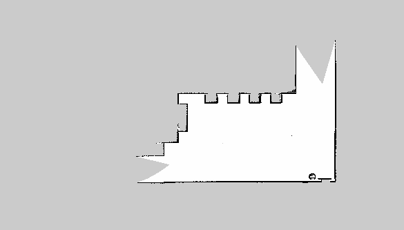
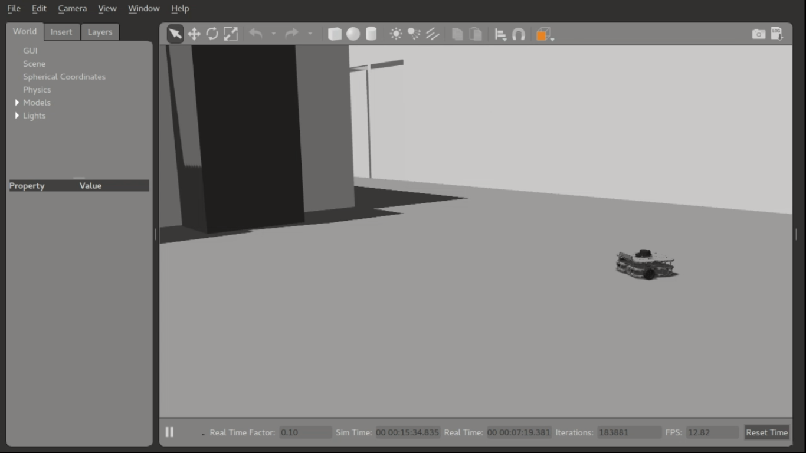

# ros_homework_2 #
##### Homework 2 [Laboratorio Ciberfisico] - University of Verona #####

### Descrizione
L'homework 2 prevede la costruzione di un ambiente virtuale per il tool Gazebo disponibile con ROS (nel mio caso la distro Kinetic), in modo tale da poter essere simulato con il robot `Turtlebot3`.
La mia scelta (tra le opzioni definite dall'homework) è stata quella di modellare una parte del dipartimento di Informatica dell'Università di Verona, in particolare il piano 1 del blocco Ca Vignal 2.

Il modello 3D della piantina del piano è stato costruito con SolidWorks, un programma CAD per modellazioni 3D che permette di esportare progetti in `STL`, da convertire poi in `COLLADA` (.dae), formato compatibile con Gazebo. Gli altri elementi (panchine da sala di attesa, cestino, armadi e termosifoni) sono stati realizzati sia direttamente in Gazebo, che importati dal catalogo online di questo. 

### Istruzioni per l'installazione
Clonare il seguente repository:
```sh
$ git clone https://github.com/vladbragoi/ros_homework_2.git
```
Posizionarsi nella directory ros_homework_2 e lanciare lo script "setup.sh" con il comando:
```sh
$ ./setup.sh
```
Eseguire le seguenti istruzioni:
```sh
$ export TURTLEBOT3_MODEL=waffle
$ roslaunch turtlebot3_gazebo turtlebot3_cv2.launch
```
Per la navigazione autonoma:
```sh
$ roslaunch turtlebot3_gazebo turtlebot3_simulation.launch
```

### Mappa dello scenario creato
Per la navigazione autonoma con rviz è stata mappata soltanto una parte del modello tridimensionale, corrispondente all'angolo in basso a destra del piano, com'è possibile vedere dalla seguente immagine:

[](media/map.png)

Per eventuali mappe più complete è possibile eseguire la mappatura completa manualmente utilizzando i seguenti comandi (occorre aver aviato l'ambiente nel simulatore):

```sh
$ roslaunch turtlebot3_slam turtlebot3_slam.launch
$ rosrun rviz rviz -d `rospack find turtlebot3_slam`rviz/turtlebot3_slam.rviz
$ roslaunch turtlebot3_teleop turtlebot3_teleop_key.launch
$ rosrun map_server map_saver -f $HOME/ros_homework_2/map/map
```

Poi successivamente è possibile eseguire la navigazione autonoma specificando la mappa creata usando il comando:
```sh
$ roslaunch turtlebot3_navigation turtlebot3_navigation.launch map_file:=$HOME/ros_homework_2/map/map.yaml
$ rosrun rviz rviz -d `rospack find turtlebot3_navigation`rviz/turtlebot3_nav.rviz
```

Il video relativo alla navigazione autonoma è disponibile con il `clone` del seguente repository (dentro la directory `media`) e visualizzabile al link sotto.


### Watch the video simulation ###
[](https://youtu.be/u7z6F1_MQ9o)
(click the preview to open video on youtube)

### References ###

* [Course page (prof. Bloisi - Univr)](profs.scienze.univr.it/~bloisi/corsi/ciberfisico.html)

* [Gazebo: building a world](http://gazebosim.org/tutorials?tut=build_world)

* [Gazebo: using roslaunch](http://gazebosim.org/tutorials?tut=ros_roslaunch)

* [Gazebo: import meshes](http://gazebosim.org/tutorials?tut=import_mesh)

* [ROS: create your own world](http://wiki.ros.org/cob_gazebo_worlds/Tutorials/Create%20your%20own%20world)

* [Cyberlab world](https://github.com/dbloisi/cyber_lab_gazebo)


### Author ###

* `Vladislav Bragoi`, University of Verona (Italy) [vladislav.bragoi@studenti.univr.it](mailto:vladislav.bragoi@studenti.univr.it)

### License ###

> MIT License
>
> Copyright (c) 2018 Vladislav Bragoi
> 
> Permission is hereby granted, free of charge, to any person obtaining a copy
> of this software and associated documentation files (the "Software"), to deal
> in the Software without restriction, including without limitation the rights
> to use, copy, modify, merge, publish, distribute, sublicense, and/or sell
> copies of the Software, and to permit persons to whom the Software is
> furnished to do so, subject to the following conditions:
> 
> The above copyright notice and this permission notice shall be included in all
> copies or substantial portions of the Software.
> 
> THE SOFTWARE IS PROVIDED "AS IS", WITHOUT WARRANTY OF ANY KIND, EXPRESS OR
> IMPLIED, INCLUDING BUT NOT LIMITED TO THE WARRANTIES OF MERCHANTABILITY,
> FITNESS FOR A PARTICULAR PURPOSE AND NONINFRINGEMENT. IN NO EVENT SHALL THE
> AUTHORS OR COPYRIGHT HOLDERS BE LIABLE FOR ANY CLAIM, DAMAGES OR OTHER
> LIABILITY, WHETHER IN AN ACTION OF CONTRACT, TORT OR OTHERWISE, ARISING FROM,
> OUT OF OR IN CONNECTION WITH THE SOFTWARE OR THE USE OR OTHER DEALINGS IN THE
> SOFTWARE.
 