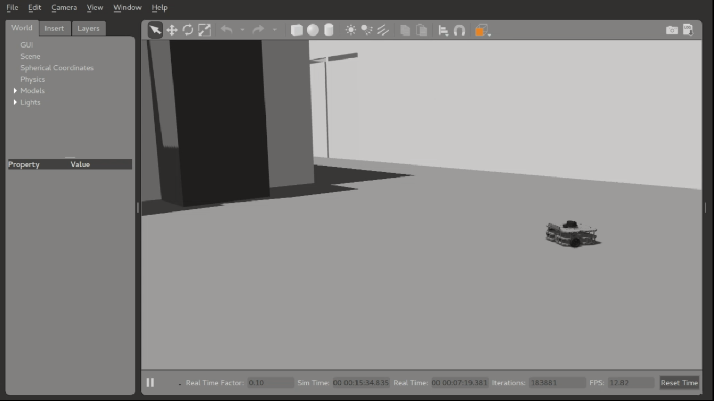

# ros_homework_2 #
##### Homework 2 [Laboratorio Ciberfisico] - University of Verona #####

<video controls="controls" poster="img/demo.jpg" width="640" height="360">
    <source src="turtlebot3_autonomous_driving.mp4" type="video/mp4" />
    <object type="application/x-shockwave-flash"
            data="swf/flowplayer-3.2.18.swf" width="640" height="360">
        <param name="movie" value="swf/flowplayer-3.2.18.swf" />
        <param name="allowFullScreen" value="true" />
        <param name="wmode" value="transparent" />
        <param name="flashVars"
               value="config={'playlist':['..%2Fimg%2Fdemo.jpg',{'url':'..%2Fvid%2Fdemo.mp4','autoPlay':false}]}" />
        <!-- fallback image if flash fails -->
        
    </object>
</video>

### References ###
[Course page (prof. Bloisi - Univr)](profs.scienze.univr.it/~bloisi/corsi/ciberfisico.html)

[Ros msg](http://wiki.ros.org/msg)

[Ros tutorials](http://wiki.ros.org/ROS/Tutorials)

### Author ###

* `Vladislav Bragoi`, University of Verona (Italy) [vladislav.bragoi@studenti.univr.it](mailto:vladislav.bragoi@studenti.univr.it)

### License ###

> MIT License
>
> Copyright (c) 2018 Vladislav Bragoi
> 
> Permission is hereby granted, free of charge, to any person obtaining a copy
> of this software and associated documentation files (the "Software"), to deal
> in the Software without restriction, including without limitation the rights
> to use, copy, modify, merge, publish, distribute, sublicense, and/or sell
> copies of the Software, and to permit persons to whom the Software is
> furnished to do so, subject to the following conditions:
> 
> The above copyright notice and this permission notice shall be included in all
> copies or substantial portions of the Software.
> 
> THE SOFTWARE IS PROVIDED "AS IS", WITHOUT WARRANTY OF ANY KIND, EXPRESS OR
> IMPLIED, INCLUDING BUT NOT LIMITED TO THE WARRANTIES OF MERCHANTABILITY,
> FITNESS FOR A PARTICULAR PURPOSE AND NONINFRINGEMENT. IN NO EVENT SHALL THE
> AUTHORS OR COPYRIGHT HOLDERS BE LIABLE FOR ANY CLAIM, DAMAGES OR OTHER
> LIABILITY, WHETHER IN AN ACTION OF CONTRACT, TORT OR OTHERWISE, ARISING FROM,
> OUT OF OR IN CONNECTION WITH THE SOFTWARE OR THE USE OR OTHER DEALINGS IN THE
> SOFTWARE.
 